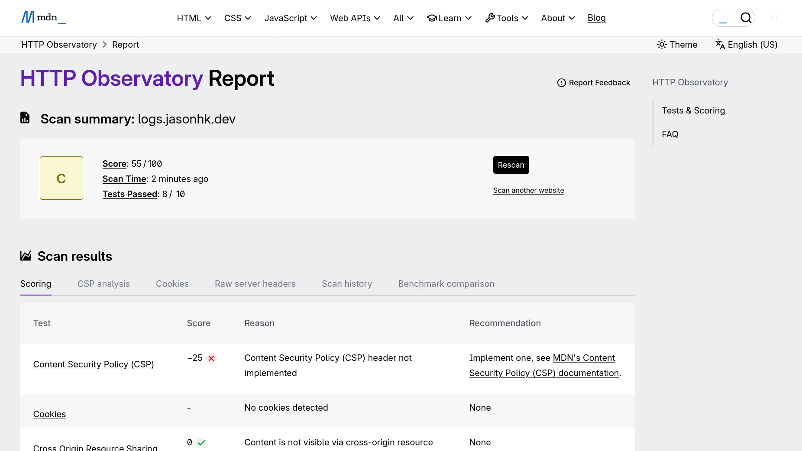

## 背景

筆者最近用 Hugo 建了幾個網站，但發現這些網站在 [Mozilla Observatory](https://developer.mozilla.org/en-US/observatory) 的評分只是一般（包括本站）。由於網站託管於 Cloudflare，筆者可以透過新增 `_headers` 檔案加入部分所需的 HTTP 標頭，先解決一部分問題。最後仍有一項需要處理：為內嵌腳本（以及樣式）加入 <abbr title="Content Security Policy">CSP</abbr> 雜湊；Hugo 本身做不到，因此需要另覓方法。



### 行不通的方案

筆者發現 Cloudflare Pages 有一個名為「[Pages Plugin](https://developers.cloudflare.com/pages/functions/plugins/)」的功能，心想「應該已經有人做好現成方案吧！」。結果有，但又未必算是：目前看來**唯一**的相關套件已經失效。



因此，筆者打算自行撰寫一個 Pages Plugin。不過隨之而來的問題是：仍可否把現有的標頭規則保留在 `_headers` 之中？

## 疑問

筆者發現 Cloudflare Pages 文件有兩段說明頗為令人困惑：

> `_headers` 檔案最多可包含 100 條 header 規則。
>
> `_headers` 檔案內的單一 header 最多可有 2,000 個字元。若需管理更長的 header，建議改用 [Pages Functions](https://developers.cloudflare.com/pages/functions/)。
>
> — <cite>[Limits, Cloudflare Pages docs](https://developers.cloudflare.com/pages/platform/limits/#headers:~:text=Headers-,A,Functions%2E)</cite>

> > [!WARNING] 
> > 在 `_headers` 檔案中定義的自訂 headers，不會套用到由 [Pages Functions](https://developers.cloudflare.com/pages/functions/) 產生的回應，即使請求 URL 符合 `_headers` 內的規則亦然。若你使用伺服器端渲染（SSR）框架，或使用 Pages Functions（無論是 [`functions/`](https://developers.cloudflare.com/pages/functions/routing/) 目錄路由，或「advanced mode」的 [`_worker.js`](https://developers.cloudflare.com/pages/functions/advanced-mode/)），你很可能需要在 Pages Functions 的程式碼內，直接附加你希望套用的任何自訂 headers。
>
> — <cite>[Headers, Cloudflare Pages docs](https://developers.cloudflare.com/pages/configuration/headers/#:~:text=Warning-,Custom,code)</cite>

文件並未清楚交代：對於靜態資源的回應，`_headers` 會在甚麼時機被插入；以及一旦使用 middleware，`_headers` 是否會被忽略。這令筆者產生疑問：

`_headers` 會在甚麼時候被加入到靜態資源的回應之中？如果筆者使用 middleware 加入新 headers，又會發生甚麼事？下文會以實驗嘗試回答。

## 實驗

首先，筆者準備以下用於實驗的檔案，並部署到 Cloudflare Pages：

```html { title="public/index.html" }
<!DOCTYPE html>
<html lang="en">
    ...
</html>
```

```txt { title="public/_headers" }
/*
    X-Static-Headers: 1
```

```ts { title="functions/hello.ts" }
export const onRequest: PagesFunction = async (request) =>
{
    const response = new Response("Hello!");
    response.headers.append("X-Function-Headers", "1");
    return response;
};
```

```ts { title="functions/_middleware.ts" }
export const onRequest: PagesFunction = async (request) =>
{
    const response = await request.next();
    response.headers.append("X-Middleware-Headers", "1");
    console.log("Middleware Headers:");
    console.log(JSON.stringify(Array.from(response.headers), null, 2));
    return response;
};
```

## 結果

連線到已部署的網站時，回應標頭如下：

```console { title="終端機" }
> curl -I https://headers.pages-testbed.pages.dev/
HTTP/2 200 
...
x-middleware-headers: 1
...
x-static-headers: 1
...

> curl -I https://headers.pages-testbed.pages.dev/hello
HTTP/2 200 
...
x-function-headers: 1
x-middleware-headers: 1
...
```

以下為 middleware 的輸出：

```console { title="終端機" }
> npx wrangler pages deployment tail --project-name pages-testbed ...
...
GET https://headers.pages-testbed.pages.dev/ - Ok
  (log) Middleware Headers:
  (log) [
  ...
  [
    "x-middleware-headers",
    "1"
  ],
  ...
  [
    "x-static-headers",
    "1"
  ]
]
```

## 結論

由結果可見，middleware 並不在乎回應來源是 Pages Function 還是靜態資源；兩者皆會經過 middleware。由於 `_headers` 是在 middleware **之前**被插入，因此筆者可以安心把適用於靜態資源的 headers 規則保留在 `_headers` 檔案之中，然後在 middleware 內動態建立 CSP headers（配合筆者尚未完成的 Pages Plugin）。
