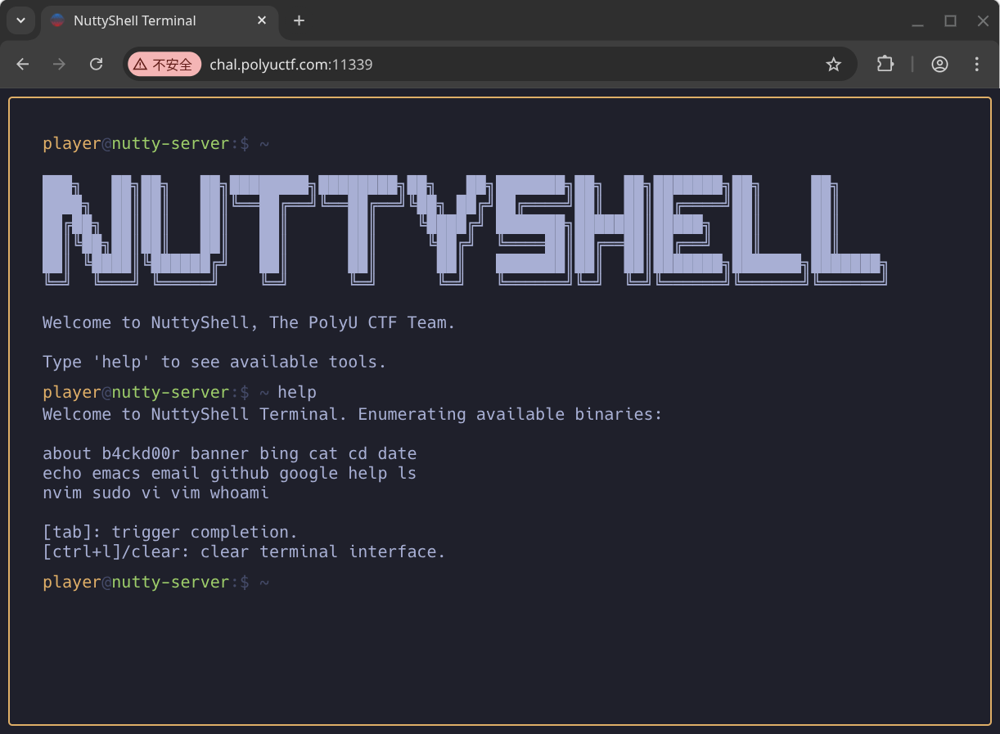
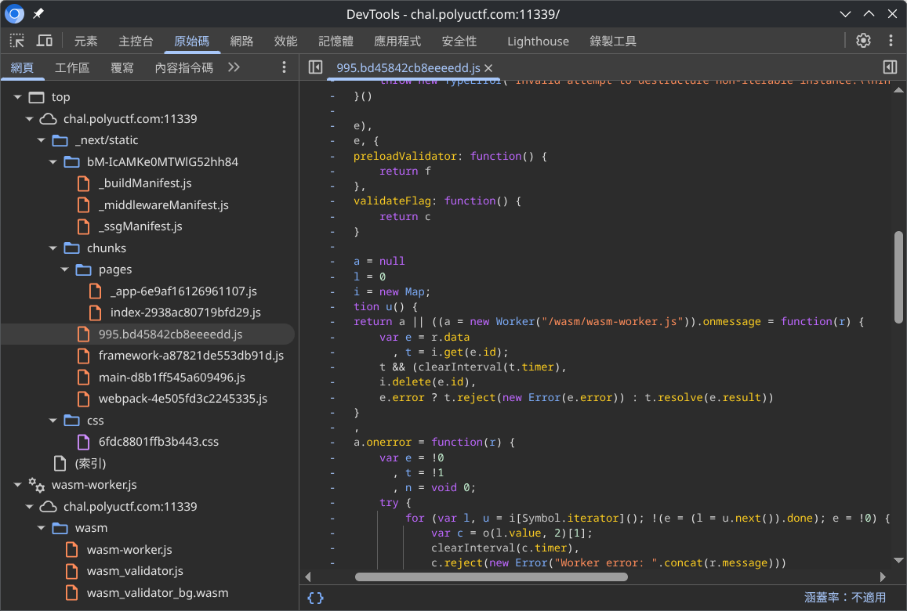
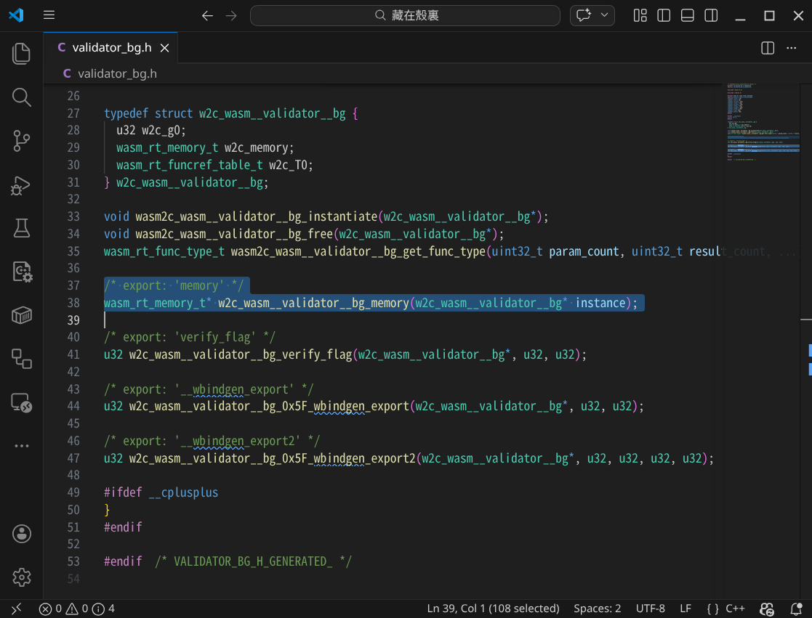

<p>

  

### Description

Just cat the flag. But where is it?

### Flag Format

`PUCTF26{[a-zA-Z0-9_]+_[a-fA-F0-9]{32}}`

### Author

liyanqwq

  

</p>

## Analysis

The challenge is a website with a fake terminal. It provide a set of "commands", most of them are just trolls. Like, for example, the `sudo` and `b4ckd00r` commands will opens a new browser tab with Rick Astley's [*Never Gonna Give You Up*](https://www.youtube.com/watch?v=dQw4w9WgXcQ).



Upon closer inspection, I found out that the website was built with [Next.js](https://nextjs.org/), with [Webpack](https://webpack.js.org/) as the bundler. In additional, I've also stumble across the implementation of the commands.


After deobfuscated the `index.js` file (with the help from LLM :smile:), I discovered a very suspicious dynamic `import()`. The target module will only be imported if the `b4ckd00r` command was called with non-empty arguments.


When I add an argument after the `b4ckd00r` command, lo and behold, the behaviour changed and new scripts (plus a [WebAssembly](https://webassembly.org/) module) are loaded! They are `995.js`, `wasm-worker.js`, `wasm_validator.js` and `wasm_validator_bg.wasm`, the latter three are inside a [Web Worker](https://developer.mozilla.org/en-US/docs/Web/API/Web_Workers_API/Using_web_workers).




From the worker script, I can see that the validation is done asynchronously as a background via the WebAssembly module. Even though the decompiled C code of the WebAssembly module are not very useful, its C header give me valuable insight on the exported objects. This might be enough to reverse the flag. Let's start cracking!



## Solution

Based on the validator from the worker, I build a minimal version of it while also exposed the internal memory of the WebAssembly module:

```js { title="validator.js" }
import fs from "node:fs";

const { instance } = await WebAssembly.instantiate(fs.readFileSync("wasm_validator_bg.wasm"), {});
const validator = instance.exports;
const malloc = validator.__wbindgen_export;

export const memory = validator.memory;

/**
 * @param {string} flag 
 * @returns {boolean}
 */
export function verifyFlag(flag)
{
    const buffer = new TextEncoder().encode(flag);
    const pointer = malloc(buffer.length, 1);
    new Uint8Array(validator.memory.buffer).set(buffer, pointer);
    return Boolean(validator.verify_flag(pointer, buffer.length));
}
```

With this, I can write a cracker script to read the memory after invoked the `verifyFlag()` function:

```js { title="flag-cracker.js" }
import { argv } from "node:process";
import { memory, verifyFlag } from "./validator.js";

const FLAG_PATTERN = /PUCTF26\{[A-Za-z0-9_]+_[a-fA-F0-9]{32}\}/g;

const input = argv.slice(2).join(" ");
console.log("verifyFlag(%o)", input);
console.log("// %o", verifyFlag(input));

console.log();

const memoryString = new TextDecoder("latin1").decode(new Uint8Array(memory.buffer));
const flags = Array.from(memoryString.matchAll(FLAG_PATTERN)).map((matches) => matches[0]);
console.log("Flags in memory:");
flags.forEach((flag) => console.log("- %o", flag));
```

Then you can get the flag by running the script:

```console { title="Terminal" }
> node flag-cracker
verifyFlag('')
// false

Flags in memory:
- 'PUCTF26{C4t_c4T_7h3_w45M_6c138b4309f10ce058582896f8d2e581}'

> node flag-cracker 'PUCTF26{C4t_c4T_7h3_w45M_6c138b4309f10ce058582896f8d2e581}'
verifyFlag('PUCTF26{C4t_c4T_7h3_w45M_6c138b4309f10ce058582896f8d2e581}')
// true

Flags in memory:
- 'PUCTF26{C4t_c4T_7h3_w45M_6c138b4309f10ce058582896f8d2e581}'
- 'PUCTF26{C4t_c4T_7h3_w45M_6c138b4309f10ce058582896f8d2e581}'
- 'PUCTF26{C4t_c4T_7h3_w45M_6c138b4309f10ce058582896f8d2e581}'
```

### Final Flag

`PUCTF26{C4t_c4T_7h3_w45M_6c138b4309f10ce058582896f8d2e581}`
