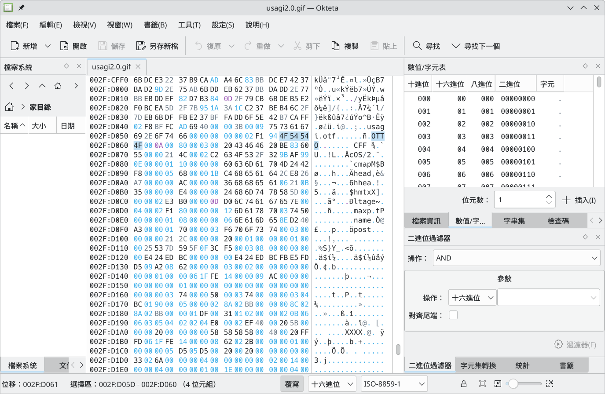
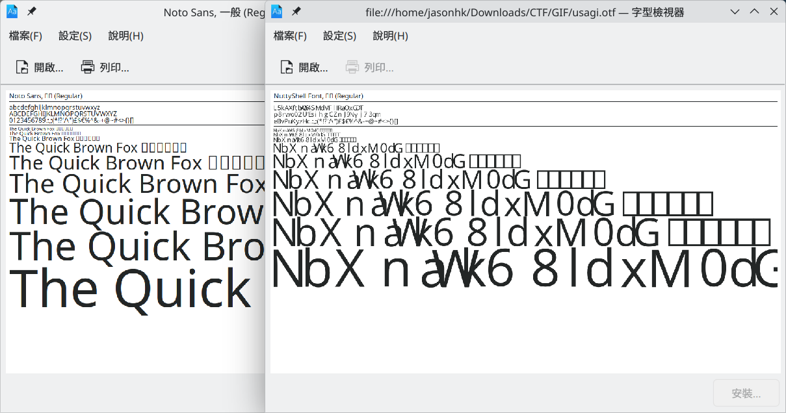
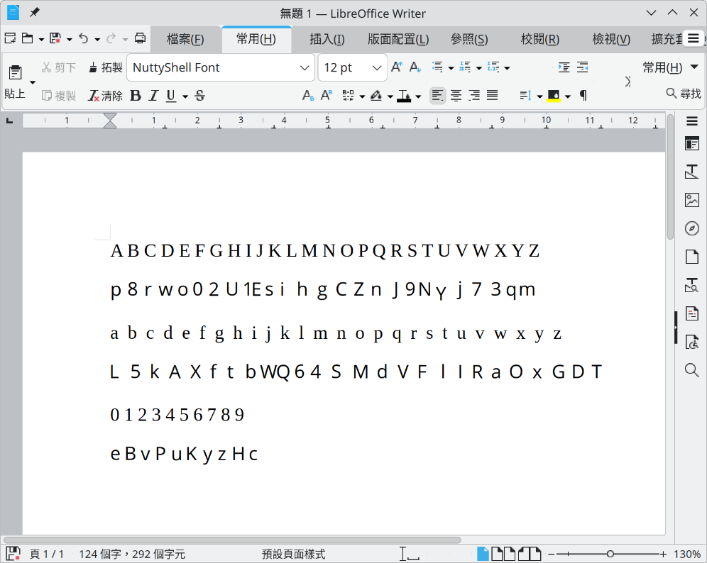

<p>

  

### Description

Usagi yaha!! ura ura〜♪ ears tall yellow zoom zoom dash pudding radar on full blast nom nom gulp! Haa-? Chiikawa wobble tear sparkle, Usagi pinch pinch tease haa〜? fearless jump thwack! stone precision monster down iyaha!! Hachiware sigh peaceful bubble pop pop, Usagi already gone uraa!! recycle shop cursed item grab grab trouble incoming プルャ〜！ friends in pinch? Usagi appear god speed assist throw throw victory pose yaha yaha!! where sleep? nobody know mystery rabbit-not-rabbit secret base ura〜… onigiri steal one bite crunch crunch disappear zoom! glutton mode activate food scent waft waft chase chase!! Chiikawa haa-? cry waa waa, Usagi head pat pat chaos comfort friend forever フルルルルァーイ！！

Usagi ura! pudding cup lick lick empty in seconds iyaa〜!! monster roar loud, ears flat calm, explosive stick twirl twirl boom victory!! tease pinch pinch again haa-? nobody mad forever because Usagi strong reliable wildcard best buddy yaha!! ura ura ura〜♪

### Files

- [ usagi2.0.gif](files/usagi2.0.gif)

### Flag Format

`PUCTF26{[a-zA-Z0-9_]+_[a-fA-F0-9]{32}}`

  

</p>

## Analysis

The GIF consist of 48 fast moving frames, many of those are duplicates, and only the last 3 distinct frames are important to the challenge (the encoded flag: `ZYrN0vy{Y9L2W_iCOX_wLMkWMt_p_4dRN_kzvByLXcKcyPzey5ecXHfLczPXzBPfzX}`).



Upon investigation, I've found that the GIF file is actually a "[polyglot](https://en.wikipedia.org/wiki/Polyglot_(computing))". At hex `2FD04C`, there is a text "usagi.otf", and the binary blob starting from hex `2FD05D` is an [OpenType](https://en.wikipedia.org/wiki/OpenType) font. This is a huge clue for the challenge.



After opened the font in a font viewer, I can immediately see that the glyphs was scrambled. That means I'm very close to the solution now.



## Solution

After installing the extracted font, open a text editor to build a mapping of the alphanumeric characters.



With the mapping, you can then write an un-scrambler for it:

```py { title="unscramble.py" }
#!/usr/bin/env python3
import sys

SCRAMBLED = (
    "p8rwo02U1EsihgCZnJ9NYj73qm" # A-Z
    "L5kAXftbWQ64SMdVFlIRaOxGDT" # a-z
    "eBvPuKyzHc"                 # 0-9
)
ORIGINAL = (
    "ABCDEFGHIJKLMNOPQRSTUVWXYZ"
    "abcdefghijklmnopqrstuvwxyz"
    "0123456789"
)

TABLE = str.maketrans(SCRAMBLED, ORIGINAL)

def decode(text: str) -> str:
    return text.translate(TABLE)

if __name__ == "__main__":
    if len(sys.argv) > 1:
        print(decode(" ".join(sys.argv[1:])))
    else:
        for line in sys.stdin:
            print(decode(line), end="")
```

Then you can get the flag by running the script:

```console { title="Terminal" }
> ./unscramble.py "ZYrN0vy{Y9L2W_iCOX_wLMkWMt_p_4dRN_kzvByLXcKcyPzey5ecXHfLczPXzBPfzX}"
PUCTF26{USaGi_LOve_Dancing_A_lotT_c7216ae95963706b09e8fa973e713f7e}
```

### Final Flag

`PUCTF26{USaGi_LOve_Dancing_A_lotT_c7216ae95963706b09e8fa973e713f7e}`
